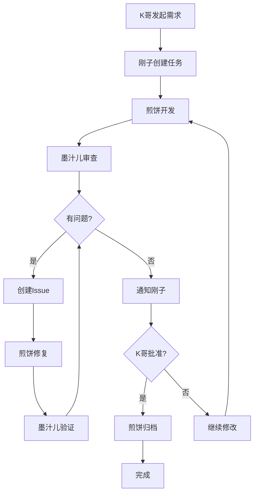

# Docker-Claw 🤖🐶🦊

> 基于 OpenClaw 的多Agent协作开发系统

[](LICENSE)
[](https://github.com/openclaw/openclaw)
[](https://www.docker.com/)

## 📖 项目简介

Docker-Claw 是一个创新的多Agent协作系统，通过三个AI助手（刚子、煎饼、墨汁儿）的协同工作，实现从需求到代码交付的完整自动化流程。

### 🎭 三个核心角色

- **🤖 刚子（协调者）** - 负责与用户通信、任务调度、状态监控、归档管理
- **🐶 煎饼（开发者）** - 负责读取需求、编写代码、Git操作、处理Issue
- **🦊 墨汁儿（审查者）** - 负责设计测试、代码审查、创建Issue、验证修复

### ✨ 核心特性

- ✅ **完全自动化** - 从需求到归档的全流程自动化
- ✅ **智能协作** - 三个Agent通过状态文件和GitHub Issues协作
- ✅ **定时监控** - Heartbeat（10分钟）+ Cron（5分钟）定时任务
- ✅ **异常处理** - 15轮Issue检测、Agent离线监控、Git冲突处理
- ✅ **容器化部署** - 煎饼和墨汁儿运行在Docker容器中
- ✅ **状态透明** - 所有状态实时记录在共享文件中
- ✅ **历史追踪** - 以项目→任务→Agent三级结构记录完整历史（新增）

---

## 🚀 快速开始

### 前置要求

- [Docker](https://www.docker.com/) 20.10+
- [Node.js](https://nodejs.org/) 22+ （刚子需要）
- [OpenClaw CLI](https://github.com/openclaw/openclaw) （刚子需要）
- [Git](https://git-scm.com/) 2.30+
- [jq](https://stedolan.github.io/jq/) 1.6+

### 1. 克隆项目

```bash
git clone https://github.com/yourname/docker-claw.git
cd docker-claw
```

### 2. 配置环境变量

```bash
# 复制环境变量模板
cp .env.example .env

# 编辑配置文件
vim .env
```

**必需配置：**
```bash
# GitHub配置
GITHUB_TOKEN=ghp_your_github_token_here
GITHUB_REPO=yourname/yourrepo

# Agent模型配置（每个Agent可使用不同模型）
GANGZI_API_KEY=your_kimi_api_key      # 刚子 - Kimi
JIANBING_API_KEY=your_minimax_api_key # 煎饼 - MiniMax
MOZHI_API_KEY=your_zhipu_api_key      # 墨汁儿 - 智谱GLM
```

**可选配置：**
```bash
# Git配置
GIT_USER_NAME="Your Name"
GIT_USER_EMAIL="your@email.com"

# 工作目录
WORKSPACE_PATH=/path/to/workspace

# 飞书配置（用于刚子与用户通讯）
FEISHU_APP_ID=your_feishu_app_id
FEISHU_APP_SECRET=your_feishu_app_secret
```

### 3. 初始化共享目录

```bash
./scripts/init-shared.sh
```

### 4. 启动所有Agent

```bash
# 一键启动所有Agent
./scripts/start-all.sh
```

或分别启动：

```bash
# 启动刚子（宿主机）
./scripts/start-gangzi.sh

# 启动煎饼（容器）
./scripts/start-jianbing.sh

# 启动墨汁儿（容器）
./scripts/start-mozhi.sh
```

### 5. 验证运行状态

```bash
# 查看刚子状态
openclaw gateway status

# 查看容器状态
docker ps

# 查看任务汇总
cat shared/status/summary.json | jq .

# 查看日志
tail -f shared/logs/gangzi.log
docker logs -f jianbing-claw-container
docker logs -f mozhi-claw-container
```

---

## 📚 使用指南

### 创建第一个任务

1. **向刚子发送需求**（通过消息平台，如Telegram）：
   ```
   刚子，帮我开发用户认证功能
   ```

2. **刚子自动执行**：
   - 创建 `milestone.md`
   - 创建 `feature/task-001` 分支
   - 启动 Cron 任务
   - 通知煎饼和墨汁儿

3. **煎饼开始开发**：
   - 读取 `milestone.md`
   - 实现代码（多个commit）
   - 本地测试
   - Push代码

4. **墨汁儿开始审查**：
   - 设计测试计划
   - 审查代码（质量、安全、性能）
   - 创建GitHub Issue（如果有问题）
   - 验证修复

5. **刚子监控进度**：
   - 每10分钟汇报进度
   - Issue超时（15轮）立即通知
   - 审查通过后询问归档

6. **K哥批准归档**：
   ```
   可以归档
   ```

7. **煎饼执行归档**：
   - 归档 `milestone.md`
   - 合并到 `main` 分支
   - 删除 `feature` 分支

---

## 🏗️ 项目结构

```
docker-claw/
├── config/                      # Agent配置目录
│   ├── gangzi/                 # 刚子配置
│   │   ├── SOUL.md            # 人格设计
│   │   ├── AGENTS.md          # 工作指南
│   │   ├── HEARTBEAT.md       # 心跳任务
│   │   ├── IDENTITY.md        # 基础身份
│   │   └── skills/            # 技能目录
│   │       ├── start-task/
│   │       ├── end-task/
│   │       ├── monitor/
│   │       ├── handle-archive/
│   │       └── handle-exception/
│   ├── jianbing/               # 煎饼配置
│   │   ├── SOUL.md
│   │   ├── AGENTS.md
│   │   ├── IDENTITY.md
│   │   └── skills/
│   │       ├── develop/
│   │       ├── check-issues/
│   │       ├── handle-issue/
│   │       └── archive/
│   └── mozhi/                  # 墨汁儿配置
│       ├── SOUL.md
│       ├── AGENTS.md
│       ├── IDENTITY.md
│       └── skills/
│           ├── design-test/
│           ├── check-commits/
│           ├── review/
│           ├── create-issue/
│           └── verify-fix/
│
├── shared/                      # 共享目录（Agent间通信）
│   ├── config.json             # 全局配置
│   ├── status/                 # 状态目录
│   │   ├── summary.json        # 任务汇总
│   │   ├── gangzi.json         # 刚子状态
│   │   ├── jianbing.json       # 煎饼状态
│   │   └── mozhi.json          # 墨汁儿状态
│   ├── history/                # 历史记录（新增）
│   │   ├── projects/           # 项目目录
│   │   │   └── PROJ-{name}/    # 项目
│   │   │       ├── project.json
│   │   │       └── tasks/
│   │   │           └── TASK-{id}/  # 任务
│   │   │               ├── task.json
│   │   │               └── agents/
│   │   │                   ├── gangzi.json
│   │   │                   ├── jianbing.json
│   │   │                   └── mozhi.json
│   │   └── index.json          # 全局索引
│   ├── issues/                 # Issue追踪
│   ├── logs/                   # 日志目录
│   └── templates/              # 状态文件模板
│       └── history/            # 历史记录模板（新增）
│
├── scripts/                     # 脚本目录
│   ├── init-shared.sh          # 初始化共享目录
│   ├── start-gangzi.sh         # 启动刚子
│   ├── start-jianbing.sh       # 启动煎饼
│   ├── start-mozhi.sh          # 启动墨汁儿
│   ├── start-all.sh            # 启动所有Agent
│   └── stop-all.sh             # 停止所有Agent
│
├── docs/                        # 文档目录
│   ├── workflow.md             # 工作流程
│   ├── configuration-checklist.md  # 配置清单
│   ├── progress-report.md      # 进度报告
│   ├── milestone-lifecycle.md  # milestone.md生命周期
│   └── PROJECT-COMPLETE.md     # 完成报告
│
├── workspace/                   # Git仓库工作目录（可选）
│   ├── milestone.md            # 当前任务（只在feature分支）
│   └── milestones/             # 归档的任务
│       ├── 001_xxx.md          # 已完成的任务1
│       └── 002_xxx.md          # 已完成的任务2
│
├── .env.example                # 环境变量模板
└── README.md                   # 本文件
```

### 📝 关于 milestone.md

**重要说明：**
- `milestone.md` 只存在于 **feature 分支**
- `main` 分支**不会有** `milestone.md`
- 归档后会移动到 `milestones/` 目录

**生命周期：**
```
刚子创建 feature 分支 → 创建 milestone.md → 提交
         ↓
    煎饼在 feature 分支开发
         ↓
    墨汁儿在 feature 分支审查
         ↓
    归档：milestone.md → milestones/001_xxx.md
         ↓
    合并到 main 分支（milestones/ 目录保留）
```

详见：[milestone.md 生命周期](./docs/milestone-lifecycle.md)

---

---

## 🔄 工作流程



### 详细流程

1. **需求阶段**
   - K哥 → 刚子：发送需求
   - 刚子：创建 `milestone.md`
   - 刚子：创建 `feature` 分支
   - 刚子：启动 Cron 任务

2. **开发阶段**
   - 煎饼：读取 `milestone.md`
   - 煎饼：本地开发（多个commit）
   - 煎饼：本地测试
   - 煎饼：Push代码

3. **审查阶段**
   - 墨汁儿：设计测试计划
   - 墨汁儿：审查代码
   - 墨汁儿：执行测试
   - 墨汁儿：创建Issue（如果有问题）

4. **修复阶段**
   - 煎饼：处理Issue
   - 墨汁儿：验证修复
   - 循环直到通过 OR 15轮

5. **归档阶段**
   - 刚子：询问K哥归档
   - K哥：批准归档
   - 煎饼：合并到 `main`
   - 煎饼：归档 `milestone.md`

---

## ⚙️ 配置说明

### 刚子（协调者）

**核心职责：**
- 与K哥通信
- 任务调度
- 状态监控（每10分钟）
- 归档管理
- 异常处理

**配置文件：**
- `config/gangzi/SOUL.md` - 人格和角色
- `config/gangzi/AGENTS.md` - 工作指南
- `config/gangzi/HEARTBEAT.md` - 心跳任务
- `config/gangzi/IDENTITY.md` - 基础身份

**技能：**
1. `start-task` - 启动新任务
2. `end-task` - 结束任务
3. `monitor` - 监控状态
4. `handle-archive` - 处理归档
5. `handle-exception` - 处理异常

### 煎饼（开发者）

**核心职责：**
- 读取 `milestone.md`
- 实现代码
- Git操作（commit, push, merge）
- 处理Issue

**配置文件：**
- `config/jianbing/SOUL.md` - 人格和Git规范
- `config/jianbing/AGENTS.md` - 工作指南
- `config/jianbing/IDENTITY.md` - 基础身份

**技能：**
1. `develop` - 开发功能
2. `check-issues` - 检查Issue（Cron）
3. `handle-issue` - 处理Issue
4. `archive` - 归档任务

### 墨汁儿（审查者）

**核心职责：**
- 设计测试计划
- 代码审查（5个维度）
- 创建GitHub Issue
- 验证修复
- 15轮Issue检测

**配置文件：**
- `config/mozhi/SOUL.md` - 人格和Issue规范
- `config/mozhi/AGENTS.md` - 工作指南
- `config/mozhi/IDENTITY.md` - 基础身份

**技能：**
1. `design-test` - 设计测试
2. `check-commits` - 检查commit（Cron）
3. `review` - 审查代码
4. `create-issue` - 创建Issue
5. `verify-fix` - 验证修复

---

## 📊 历史记录功能

### 数据结构

历史记录采用**项目→任务→Agent**三级目录结构：

```
/shared/history/
├── projects/
│   └── PROJ-{project}/           # 项目目录
│       ├── project.json          # 项目信息
│       └── tasks/
│           └── TASK-{id}/        # 任务目录
│               ├── task.json     # 任务信息
│               └── agents/       # Agent事件流
│                   ├── gangzi.json
│                   ├── jianbing.json
│                   └── mozhi.json
└── index.json                    # 全局索引
```

### 核心能力

刚子通过 `history` 技能提供以下能力：

1. **create_project** - 创建新项目
2. **create_task** - 创建新任务
3. **append_event** - 记录事件（Agent状态变更）
4. **update_task_status** - 更新任务状态
5. **query_history** - 查询历史（按项目/任务/Agent/事件）
6. **get_task_stats** - 获取任务统计

### 事件类型

每个Agent在任务中的所有活动都被记录为事件：

| Agent | 事件类型 | 说明 |
|-------|---------|------|
| 刚子 | task_created, task_started, task_completed, archive_completed | 任务生命周期 |
| 煎饼 | start_developing, commit_created, push_code, fix_pushed | 开发活动 |
| 墨汁儿 | start_review, review_passed, issue_created, fix_verified | 审查活动 |

详见：[EVENT-TYPES.md](./shared/templates/history/EVENT-TYPES.md)

### 查询示例

```bash
# 查询某个任务的所有事件
cat /shared/history/projects/PROJ-default/tasks/TASK-20241215-001/agents/*.json | jq '.events[]'

# 查询某个Agent的历史
find /shared/history/projects -name "jianbing.json" -exec cat {} \; | jq '.events[]'

# 统计任务时长
cat /shared/history/projects/PROJ-default/tasks/TASK-*/task.json | jq '{task_id, created_at, completed_at}'
```

### 数据保留

- **全部保留**：所有历史数据永久保存
- **暂不支持删除**：确保数据完整性
- **未来支持Web界面**：可视化管理历史数据

---

## 📊 状态文件

### config.json - 全局配置

```json
{
  "status": "in_progress",
  "current_task": {
    "id": "task-001",
    "name": "用户认证功能",
    "github_repo": "yourname/yourrepo",
    "target_branch": "feature/task-001",
    "milestone_file": "milestone.md"
  }
}
```

### summary.json - 任务汇总

```json
{
  "task_id": "task-001",
  "status": "in_progress",
  "agents": {
    "gangzi": {"phase": "监控中", "health": "ok"},
    "jianbing": {"phase": "开发需求", "health": "ok"},
    "mozhi": {"phase": "测试设计", "health": "ok"}
  },
  "progress": {
    "issue_comments": 4,
    "issue_max_comments": 15
  }
}
```

---

## 🔧 定时任务

### 刚子 Heartbeat（10分钟）

- 检查煎饼和墨汁儿状态
- 生成进度报告
- 发送给K哥
- 检测Issue超时（15轮）
- 检测Agent离线（15分钟）

### 煎饼 Cron（5分钟）

- 查询GitHub Issues
- 过滤需要处理的Issue
- 调用 `handle-issue` 技能

### 墨汁儿 Cron（5分钟）

- 拉取最新代码
- 检查新commit
- 调用 `review` 技能

---

## 🐛 故障排查

### 问题1：刚子无法启动

```bash
# 检查OpenClaw
openclaw --version

# 检查Gateway
openclaw gateway status

# 查看日志
tail -f shared/logs/gangzi.log
```

### 问题2：容器无法启动

```bash
# 查看容器日志
docker logs jianbing-claw-container
docker logs mozhi-claw-container

# 检查环境变量
docker exec jianbing-claw-container env | grep GITHUB

# 进入容器调试
docker exec -it jianbing-claw-container bash
```

### 问题3：Git操作失败

```bash
# 检查Git配置
git config --list

# 检查SSH密钥
ssh -T git@github.com

# 检查权限
ls -la ~/.ssh
```

### 问题4：Issue无法创建

```bash
# 检查GitHub Token
gh auth status

# 测试创建Issue
gh issue create --title "Test" --body "Test"
```

---

## 📖 文档

- [工作流程](./docs/workflow.md) - 标准开发流程
- [配置文件清单](./docs/configuration-checklist.md) - 所有配置说明
- [项目完成报告](./docs/PROJECT-COMPLETE.md) - 完整项目总结
- [共享目录说明](./shared/README.md) - 通信协议

---

## 🤝 贡献指南

欢迎贡献代码和建议！

1. Fork本项目
2. 创建feature分支 (`git checkout -b feature/AmazingFeature`)
3. 提交更改 (`git commit -m 'Add some AmazingFeature'`)
4. 推送到分支 (`git push origin feature/AmazingFeature`)
5. 创建Pull Request

---

## 📄 许可证

本项目采用 MIT 许可证 - 详见 [LICENSE](LICENSE) 文件

---

## 🙏 致谢

感谢以下开源项目：

- [OpenClaw](https://github.com/openclaw/openclaw) - AI Agent框架
- [智谱AI](https://open.bigmodel.cn/) - GLM大模型
- [GitHub](https://github.com/) - 代码托管平台
- [Docker](https://www.docker.com/) - 容器化平台

---

## 📞 联系方式

- **项目地址：** https://github.com/yourname/docker-claw
- **问题反馈：** https://github.com/yourname/docker-claw/issues
- **文档：** https://github.com/yourname/docker-claw/tree/main/docs

---

## 🗺️ 路线图

### v1.0（当前）
- ✅ 完整的三角色系统
- ✅ 自动化工作流程
- ✅ Docker容器化
- ✅ 完善的异常处理

### v1.1（计划中）
- [ ] 支持更多消息平台（Slack、钉钉）
- [ ] Web UI界面
- [ ] 性能监控仪表板

### v2.0（未来）
- [ ] 支持更多AI模型（Claude、GPT）
- [ ] 插件系统
- [ ] 多项目管理

---

**项目状态：** ✅ 生产就绪  
**当前版本：** v1.0  
**维护者：** K哥 & 刚子 🤖

---

<p align="center">
  Made with ❤️ by K哥 & 刚子
</p>
